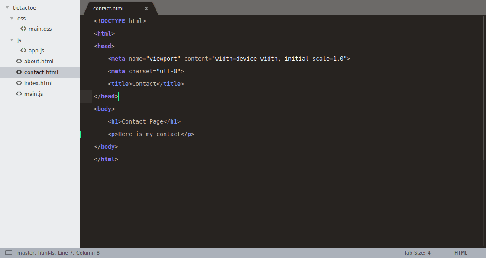

# Git Diff View - Sublime Text 3

Get a quick overview of changes before commiting them.



### Features

-   Show all modified files
-   Show the diff view for a file
-   Stage/Unstage files (staged are marked with "■", unstaged with "☐")
-   Dismiss changes for a file
-   Go to a file

### Installation 

#### Stable Version

Open the command palette and run `Package Control: Install Package`, then select `GitDiffView`.

#### Development Version

-   Clone this repository to `sublime-text-3/Packages` folder.
-   Rename the folder to `GitDiffView`.
-   Done. :wink:

### Instructions

The default keybinding for toggling the view is `ctrl+shift+g`(Linux) or `alt+shift+g`(Mac).
The git view won't open if there are no git changes.

Inside the `Git Status` view you can use the following keybinds:

```
  a - stage/unstage a file
  d - dismiss changes to a file
  g - go to a file
```

Type of modification will be shown in the git status, next to the file name.
Here is a list of the types:

```
    ?? - Untracked
     A - Added
     M - Modified
     D - Deleted
     R - Renamed
     C - Copied
    UU - Unmerged(Conflict)
```

### Note

For other Git commands, like commiting, pushing, pulling, see [Git](https://github.com/kemayo/sublime-text-git) or [GitSavvy](https://github.com/divmain/GitSavvy).
