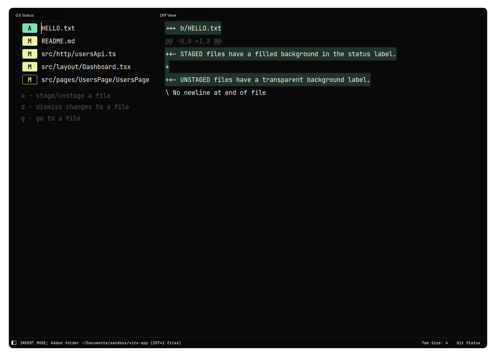

# Git Diff View

Get a quick overview of changes before committing them.



### Features

-   Show all modified files
-   Show the diff view for a file
-   Stage/Unstage files
-   Discard changes to a file
-   Goto a file

### Installation 

Open the command palette and run `Package Control: Install Package`, then select `GitDiffView`.

### Instructions

From the command palette select: `Git Diff View: Toggle`.
Or toggle the git diff view with `ctrl+shift+g`(Linux) or `alt+shift+g`(Mac).
The git diff view won't open if there are no git changes.

Inside the status view, the following keybindings are available:

```
  a - stage/unstage a file
  d - dismiss changes to a file
  g - go to a file
```

Type of modification will be shown in the git status, next to the file name.
Here is a list of the types:

```
  "??" - Untracked
  " A" - Added
  "AM" - Added and Staged
  " M" - Modified
  "MM" - Modified and Staged
  " D" - Deleted
  " R" - Renamed
  " C" - Copied
  "UU" - Unmerged(Conflict)
```

### Workflow Example

[HowToUseIt.webm](https://github.com/predragnikolic/sublime-git-diff-view/assets/22029477/3af9654c-664c-4d0c-94bf-faa6af804e5c)

> Note
For other Git commands, like committing, pushing, and pulling, see [Git](https://github.com/kemayo/sublime-text-git) or [GitSavvy](https://github.com/divmain/GitSavvy).
